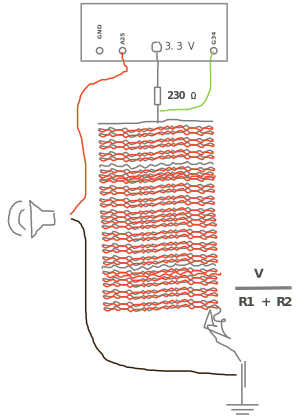

# NOTHING_EXISTS

## Project Overview
> **"In nature nothing exists alone"** 
> - *Silent Spring, Rachel Carson*

Everything in our world is interconnected, interwoven - a layered mesh that unfolds across scales of time and space beyond comprehension to the sentient mind. The attempt to grasp these hyperconnected realities requries a deliberate alteration of perception:

> "We have only to speed up our sense of time to see how strange life forms are. They arise, flicker, and vanish."  
> — *The Ecological Thought, Tim Morton*

This interactive piece bends the fabric of time, probing the impact on perception of expansion and contraction of frequencies of sequential events. The frequency of the waveforms emitted is initially too low to be intelligible as spoken words. Trough interaction—the manipulation of the fabric-the frequency shifts, rising into a perceptible range and the spoken words become intelligible.

The work seeks to demonstrate the necessity of altering representations of time and space to perceive hyperobjects - interconnected events and realities that otherwise escape our limited senses. It challenges the viewer to confront the limitations of human perception when exposed to information streams beyond perceptible scopes and ranges.

---

## Repository Structure

### 1. ESP32 Code
- **esp_32.ino**
  - Reads the output voltage of the voltage divider circuit.
  - output voltage is mapped to variables affecting playback speed and frequency of the audio.
  pin designed for modulated audio.
  - The modulated audio output pin on the ESP-32 used in this project is DAC1 (GPIO25).

### 2. Text-to-Speech (TTS) & Audio Processing
- **visual.ipynb**
  - Performs Text-to-Speech (TTS) conversion using Google Text-to-Speech (*gTTS*).
  - Saves the generated speech as a WAV file.

- **wav_to_c_array.ipynb**
  - Converts WAV files into C arrays to fit within the ESP-32's working memory, wich can then be pasted into the *.ino code.

### 3. Circuit & Hardware Information
The circuit design is a simple voltage divider using:
- **Capacitor 1:** 230Ω capacitor
- **Capacitor 2:** Conductive cloth with antistatic thread
- The resistance of the cloth varies with size, and it may require an additional resistor with either **higher or lower resistance** based on its dimensions.**Audio output pin**: DAC1 (GPIO25)
**Voltage input**: Analog (GPIO34)

---

## How It Works
1. The ESP-32 generates low-frequency sound waves from voltage readings that are audible but unintelligible.
2. Interaction with the fabric changes the frequency, making the spoken words discernible.
3. The voltage divider circuit responds dynamically to touch and manipulation, altering the waveform properties.
4. The processed audio is output through DAC (GPIO25)**Pin A25**.

---

## Requirements
- **Hardware:**
  - ESP-32 microcontroller
  - 230Ω capacitor
  - Conductive fabric with antistatic thread
  - Additional resistor (value depends on fabric size)
- **Software:**
  - Python (for Jupyter Notebooks)
  - gTTS for Text-to-Speech
  - ESP-32 development environment (Arduino IDE / PlatformIO)

---

## Installation & Setup
1. Load `esp_32.ino` onto the ESP-32 using the Arduino IDE or PlatformIO.
2. Run `radial_soundwave_visual.ipynb` to generate a TTS WAV file.
3. Use `wav_to_c_array.ipynb` to convert the WAV file into a C array.
4. Embed the C array in `esp_32.ino` and upload it to the ESP-32.
5. Connect the ESP-32 to the voltage divider circuit and fabric sensor.

---

This project invites participants to reimagine perception, time, and interconnected realities through interactive sound transformation.

